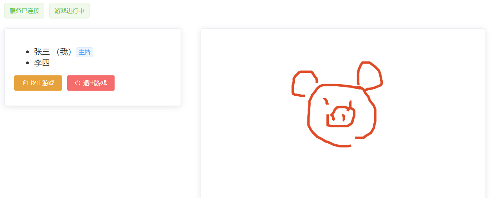
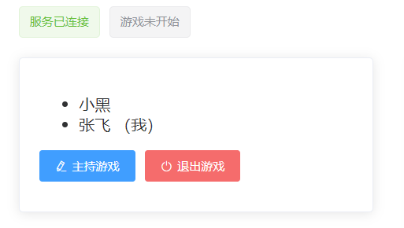

# 你画我猜 [ 乞丐版 ] - 项目准备工作



## 01- 项目介绍 - 技术架构

说明: 本次公开课讲解一个 `你画我猜` 的小游戏,  是什么样的效果?  学习了这个我们能学到什么?

讲解内容:

- 小游戏的效果是什么样的? => 效果演示

  是一个实时画图、猜答案的游戏房间

- 我们能学到什么? => 技术栈介绍

  - Vue + VueRouter +  **`Vuex(核心)`**

    作用: 便于多组件通信, 页面这里为了避免交叉操作, 页面组件只和 vuex 交互

  - **`Socket.IO (核心)`**

    负责客户端 和 服务端交互, 将服务端拿到的数据存入 Vuex Store 中

  - Konva （基于Canvas的绘图库）

    插件, 辅助开发

问题小结:

- 本节课演示了游戏效果 和 本项目的技术栈,  那么这个项目 主要练的核心技术栈 是哪两个? 
- 他们两个的作用是什么?


## 02- 项目搭建 - 环境结构准备

说明: 这边为了节约时间, 老师已经准备好了基础代码, 同学们可以直接去 gitee 上下载模板即可

```
安装依赖：yarn

启动模板：yarn serve
```

下面是模板中大致做的事情:

1. 脚手架创建项目 (选择 vuex / vue-router /  scss)

   ```
   vue create draw-guess
   ```

2. 安装导入 element-ui

   ```txt
   yarn add element-ui
   ```

   ```jsx
   import ElementUI from 'element-ui'
   import 'element-ui/lib/theme-chalk/index.css'
   
   Vue.use(ElementUI)
   ```

3. 新建页面, 配置路由

   - (1) 新建页面,  `src/views/Login/index.vue`  ` src/views/Game/index.vue`  

   - (2) 配置路由规则

   ```jsx
   const routes = [
     { path: '/', redirect: '/login' },
     { path: '/login', component: () => import('@/views/Login/index') },
     { path: '/home', component: () => import('@/views/Game/index') }
   ]
   ```

   (3) 准备页面内容 (已准备好静态结构)

   - `src/views/Login/index.vue` 的基本结构
   - ` src/views/Game/index.vue` 的基本结构 (三个子组件)


## 03- 项目搭建 - Socket.IO 客户端库

思考: 这边因为要和服务器端 **即时双向通信**,  会要求服务器能够主动向客户端推消息，所以要用到哪个技术呢?

答: `websocket` 的 `Socket.IO` 库,  本节课我们构建 `Socket.IO `的模块

讲解内容:

- 安装依赖,  **编写Socket.IO模块**,  main.js 导入
- 配置网络代理, 测试接口

**小提示: socket io 语法**

- 创建连接: `const socket = io( 地址 )`
- 发送消息:  `socket.emit(消息type类型,  消息内容,  接收到消息的回调函数)`
- 监听消息:  `socket.on(事件type类型 ,  接收到消息的回调函数)`

笔记:

1. **安装依赖包**

```bash
yarn add socket.io-client
```

2. **创建 src/socket/index.js 模块文件**

```js
import io from "socket.io-client"

const socket = io()

socket.on("connect", () => {
  console.log('>>>>>>> 和服务器已建立连接！')
})

export default socket
```

3. **在 main.js 中引入**

```js
import '@/socket'
```

4. 新建` vue.config.js `**配置网络代理**

```js
module.exports = {
  devServer: {
    proxy: {
      '/socket.io': {
        target: 'http://localhost:3000',
        changeOrigin: true
      }
    }
  }
}
```

5. 启动后台server,  并测试接口

```txt
yarn start
```

```jsx
enterGame() {
  // socket.emit(消息type类型, 消息内容, 接收到消息的回调函数)
  socket.emit('check_user_exist', this.formData.nickname, isExist => {
    console.log(isExist)
  })
}
```


**问题小结: 本节课我们构建了 `Socket.IO `的模块,  能做什么了呢?**

答: 能on监听事件接收服务器的消息了，  能够emit发送消息到服务器了


# 你画我猜 [ 乞丐版 ] - 登录模块

业务需求: 点击进入游戏按钮，表单验证，验证通过, 则发送昵称 到 服务端进行验证，如未占用则跳转到游戏主页


## 04- 封装 action - 登录请求服务端

- 编写 Vuex Action, 用于请求服务端,  看昵称是否被占用

```jsx
const actions = {
  // 确认用户名是否存在
  checkUserExist(context, nickname) {
    return new Promise((resolve, reject) => {
      socket.emit('check_user_exist', nickname, isExist => {
        resolve(isExist)
      })
    })
  }
}
```

- 页面中调用 action 测试

  说明: 登录页面中, 点击进入游戏, 先`校验用户名`是否符合格式, 符合就再`调用 action` 请求服务端

```jsx
enterGame() {
  this.$refs.loginForm.validate(async flag => {
    if (!flag) return
    const nickname = this.formData.nickname
    const isExist = await this.$store.dispatch('checkUserExist', nickname)

    if (isExist) {
      MessageBox.alert('该昵称已被人使用啦!')
    } else {
      // 将昵称存入本地, 跳转到主页
      localStorage.setItem('nickname', nickname)
      this.$router.push('/home')
    }
  })
}
```


**本章小结: 登录模块, 我们完成了什么功能?**

答: 用户输入昵称,  进入房间,  我们进行了用户名是否占用的请求,  如果没被占用, 就跳转到 home 主页


# 你画我猜 [ 乞丐版 ] - 进入房间

**说明: 跳转到主页, 就相当于进入了房间!  我们先进行进入房间要做的事情,  进行需求分析!**

需求分析:

- 当前用户 需要向服务器,  发送`进入房间`的申请请求
- 当前用户 进入房间, 服务器会通知返回 `房间信息`,  如: 房间用户列表, 主持人, 绘图信息等
- 当前用户 进入游戏房间后, 会广播`通知到其他用户`有新用户进入房间

## 05- 进入房间 - 请求服务器

步骤:

1. vuex声明 state

```jsx
const state = {
  nickname: '', // 当前用户昵称
  nicknames: [], // 房间用户昵称列表
  holder: '', // 游戏主持人
  lines: [] // 房间的绘图信息 (画了多少根线)
}
```

2. vuex提供进入房间的action 和 mutation
   - 从本地拿到 nickname, 进行 enter 请求
   - 将 nickname, `提交mutation` 存入 state

```jsx
const mutations = {
  updateNickname(state, nickname) {
    state.nickname = nickname || ''
  }
}

const actions = {
  ...
  // 进入房间
  sendUserEnter(context) {
    const nickname = localStorage.getItem('nickname')
    socket.emit('enter', nickname)
    context.commit('updateNickname', nickname)
  }
}
```

3. 主页中, 调用 action

```jsx
created() {
  this.$store.dispatch('sendUserEnter')
}
```

本节小结: 用户一进入首页, 就立刻发送一个进入房间的 enter 的请求, 并更新本地 state 的 username


## 06- 进入房间 - 处理 room_info 事件

说明:  发送这个进入房间的 enter 请求,  后台会响应 room_info 事件(房间信息),  并广播 user_enter 事件(需要监听处理)

讲解内容:

- 处理 room_info 事件,  获取房间信息, 存到 vuex中

笔记:

1. 处理 room_info 事件监听  `src/socket/index.js`

```jsx
import store from '@/store''

// 进入房间, 监听room_info事件, 获取房间信息
socket.on('room_info', ({ nicknames, holder, lines }) => {
  console.log(nicknames, holder, lines)
  store.commit('updateNicknames', nicknames)
  store.commit('updateHolder', holder)
  store.commit('updateLines', lines)
})
```

2. 提供对应的更新 mutations

```jsx
const mutations = {
  ...,
  updateNicknames(state, nicknames) {
    state.nicknames = nicknames || []
  },
  updateHolder(state, holder) {
    state.holder = holder || ''
  },
  updateLines(state, lines) {
    state.lines = lines || []
  }
}
```


## 07- 进入房间 - 处理 user_enter 事件

讲解内容:

- 处理 user_enter 事件, 处理广播
- 有其他用户进入房间会进行通知, 需要将该用户添加到用户列表中

笔记:

1. 处理 user_enter 事件,  处理广播通知,  有其他用户进入房间会进行广播通知

```jsx
socket.on('user_enter', (nickname) => {
  store.commit('addToNicknames', nickname)
})
```

2. 提供更新 nicknames 的 mutation

```jsx
addToNicknames(state, nickname) {
  if (!state.nicknames.includes(nickname)) {
    state.nicknames.push(nickname)
  }
}
```


**本章小结提问:  我们进入房间一共做了哪三件事 ?**

- 向服务器发送了`进入房间`的申请请求
- 处理 room_info 事件,  拿到服务器`返回的房间信息`,  存入 vuex 中
- 处理 user_enter 事件, 处理`新用户进入房间`的通知,  存入 vuex中


# 你画我猜 [ 乞丐版 ] - 游戏主页展示

说明: 目前, 我们已经在 vuex 中存好了 nicknames 等游戏信息, 我们可以控制主页的显示了

需求分析:

- 头部组件中展示：服务已连接 / 未连接、游戏进行中 / 未开始
- 边栏玩家列表的展示


## 08- 头部状态信息展示

说明: 头部组件中展示：`服务已连接` / `未连接`、`游戏进行中` / `未开始`, 都需要基于状态来判断

讲解内容:

- vuex 准备标记连接状态的 `connected` 和 游戏是否开始的 `getters` (有没有主持人决定了游戏是否开始)
- 监听处理 **连接/断连 事件**,  动态控制连接状态
- 界面根据标记, 处理成对应的展示效果

笔记:

1. vuex 准备连接状态 `connected` 和 游戏是否开始的` getters`

```jsx
const state = {
  connected: false, // 连接状态
  ...
}

const mutations = {
  updateConnected(state, connected) {
    state.connected = connected
  },
}


const getters = {
  isGameStarted(state) {
    // 根据主持人是否存在, 判断游戏是否开始
    return !!state.holder
  }
}
```

2. 监听处理 **连接/断连 事件** ` src/socket/index.js `

```jsx
// 处理服务连接
socket.on('connect', () => {
  store.commit('updateConnected', true)
})

// 处理服务失去连接
socket.on('disconnect', () => {
  store.commit('updateConnected', false)
})
```

3. 界面处理

```jsx
<template>
  <div class="app-header">
    <el-tag v-if="connected" type="success">服务已连接</el-tag>
    <el-tag v-else type="danger">服务未连接</el-tag>

    <el-tag v-if="isGameStarted" type="success">游戏进行中</el-tag>
    <el-tag v-else type="info">游戏未开始</el-tag>
  </div>
</template>

<script>
import { mapGetters, mapState } from 'vuex'
export default {
  computed: {
    ...mapState(['connected']),
    ...mapGetters(['isGameStarted'])
  }
}
</script>
```


## 09- 边栏玩家列表的展示

需求分析: 左边我们需要展示进入房间的玩家列表,  那么哪里有玩家列表的信息呢? 

讲解内容:

- 使用 vuex 的 nicknames 数据, 渲染视图

笔记:

1. mapState 引入 vuex 状态

```jsx
import { mapState } from 'vuex'

computed: {
  ...mapState(['nickname', 'nicknames', 'holder'])
},
```

2. v-for 遍历, 视图展示控制

```jsx
<!-- 玩家列表 -->
<div class="panel-area">
  <ul class="participants">
    <li v-for="item in nicknames" :key="item">
      <span>{{ item }} {{ item === nickname ? '（我）' : '' }}</span>
      <el-tag v-if="item === holder" size="mini">主持</el-tag>
    </li>
  </ul>
</div>
```

效果图:



**本章小结: 本章节基于 vuex 中存储的信息, 进行了首页主页的基本展示**


# 你画我猜 [ 乞丐版 ] - 游戏控制相关

## 10- 主持游戏

说明: 点击主持按钮, 可以修改游戏房间的游戏状态

需求要点:

- 点击主持按钮,  弹出对话框,  填写游戏答案
- 点击确定, 向服务器申请开始主持游戏
  - (1) 成功, 成为主持人,  服务器广播 game_started 事件, 其他人可以开始猜了
  - (2) 失败, 有人已经抢先成为了主持人, 服务器通知 already_started 事件

讲解内容:

- 控制 `主持游戏` 按钮
- 点击按钮, 弹出游戏弹框
- 输入内容, 对话框确定, 申请成为主持人
- 服务器事件处理

笔记:

1. **只有游戏未开始时，`主持游戏`按钮才会显示**

```jsx
<el-button
  v-if="!isGameStarted"
  type="primary"
  size="small"
  icon="el-icon-edit"
>主持游戏</el-button>


computed: {
  ...mapGetters(['isGameStarted'])
},
```

2. 点击主持按钮,  弹出游戏弹框

```jsx
<el-button
  v-if="!isGameStarted"
  type="primary"
  size="small"
  icon="el-icon-edit"
  @click="startGameHandler"
>主持游戏</el-button>

startGameHandler() {
  // 开始游戏
  // 1. 显示弹框
  this.resultDialogVisible = true
  // 2. 清空输入框内容
  this.expectImageName = ''
},
```


3. 输入内容, 对话框确定, 申请成为主持人

```jsx
saveDialogHandler() {
  // 1. 校验答案是否为空
  if (!this.expectImageName) {
    this.$message.error('答案不能为空哦!')
    return
  }
  // 2. 发送开始游戏的申请
  this.$store.dispatch('sendStartGame', this.expectImageName)

  // 3. 关闭弹框
  this.resultDialogVisible = false
},
```

提供对应的action

```jsx
const actions = {
  ...,
  // 开始游戏申请
  sendStartGame(context, imageAnswer) {
    socket.emit('start_game', imageAnswer)
  }
}
```


4. 服务器处理事件, 开始游戏
   - (1) 成功, 成为主持人,  服务器广播 game_started 事件, 其他人可以开始猜了
   - (2) 失败, 有人已经抢先成为了主持人, 服务器反馈 already_started 事件

```jsx
// 处理游戏开始
socket.on('game_started', holder => {
  store.commit('updateHolder', holder)
  Notification.success(`${holder} 作为主持人开始了新游戏，大家可以开始踊跃猜答案啦！`)
})

// 处理游戏已经开始, 不能重复开始
socket.on('already_started', holder => {
  store.commit('updateHolder', holder)
  MessageBox.alert('当前已有游戏在进行中，主持人是：' + holder)
})
```


本节小结: 本节课主要完成了什么功能?  `主持游戏功能 (开始游戏)`

核心步骤:

- (1) 点击按钮, 弹出游戏弹框
- (2) 输入内容, 对话框确定, 申请成为主持人
- (3) 服务器事件处理, 更新主持人


## 11- 终止游戏

说明: 点击终止按钮, 可以终止当前游戏

需求要点:

1. 游戏开始, 显示`终止游戏`或者`猜答案`,  且只有主持人, 才能看到`终止游戏`,  其他人看到的是`猜答案`
2. 点击`终止游戏`按钮, 向服务器发送 终止游戏的 申请
3. 服务器会向所有人全局反馈`游戏终止`的消息, 可以重新有人主持游戏

笔记:

1. 游戏开始, 显示`终止游戏`或者`猜答案`,  且只有主持人, 才能看到`终止游戏`,  其他人看到的是`猜答案`

```jsx
<el-button
  v-if="isGameStarted && nickname === holder"
  type="warning"
  size="small"
  icon="el-icon-delete"
>终止游戏</el-button>

<el-button
  v-if="isGameStarted && nickname !== holder"
  type="success"
  size="small"
  icon="el-icon-magic-stick"
>猜答案</el-button>
```


2. 处理点击`终止游戏`的点击事件, 向服务器发送 终止游戏的 申请

```jsx
stopGameHandler() {
  this.$confirm('确定要终止游戏吗?', '温馨提示').then(() => {
    // 发送游戏终止申请
    this.$store.dispatch('sendStopGame')
  }).catch(e => {
    console.log(e)
  })
},
```

提供 action

```jsx
// 结束游戏申请
sendStopGame(context) {
  socket.emit('stop_game')
}
```


3. 处理服务器的事件响应

```jsx
// 处理终止游戏
socket.on('game_stoped', () => {
  // 1. 清理相关数据
  store.commit('updateHolder', '')
  store.commit('updateLines', [])

  // 2. 弹出提示消息
  Notification.warning('主持人终止了当前游戏')
})
```


本节小结: 完成终止游戏的功能

核心步骤:

1. 控制终止按钮的显示隐藏   (游戏开始, 是主持人)
2. 点击按钮, 发送请求终止游戏
3. 服务器全局广播 `游戏终止`消息,   监听`game_stoped`事件处理


## 12- 鼠标绘图 - 插件导入

说明: 现在游戏可以开始, 但是主持人应该要可以绘图, 让其他人猜, 那么绘图功能又该怎么做呢?

讲解内容:

- 使用插件  Vue-Konva （基于Canvas的绘图库）完成基本的绘图功能
  - (1) 安装依赖包,  main.js 中引入
  - (2) 准备舞台注册事件
  - (3) 准备 layer 图层,   模拟 写死 line 线条演示 

笔记:

1. 安装依赖包

```txt
yarn add vue-konva konva
```

2. main.js 中引入

```jsx
import VueKonva from 'vue-konva'
Vue.use(VueKonva)
```

3. v-stage舞台准备, 事件注册

```jsx
<template>
  <el-card ref="wrapper" :body-style="{ padding: 0 }">
    <v-stage
      :config="stageConfig"
      @mousedown="mousedownHandler"
      @mouseup="mouseupHandler"
      @mousemove="mousemoveHandler"
    />
  </el-card>
</template>

<script>
export default {
  data() {
    return {
      // 画布配置
      stageConfig: {
        width: 800,
        height: 700
      },
      // 绘画状态
      painting: false
    }
  },

  mounted() {
    // 将画布宽度设置与容器同宽
    this.stageConfig.width = this.$refs.wrapper.$el.offsetWidth
  },

  methods: {
    // 鼠标按下
    mousedownHandler(e) {
      console.log('鼠标按下了')
      this.painting = true
    },

    // 鼠标拖动
    mousemoveHandler(e) {
      if (this.painting) {
        console.log('鼠标拖动了, 绘画状态')
      }
    },

    // 鼠标释放
    mouseupHandler() {
      console.log('鼠标释放了')
      this.painting = false
    }
  }
}
</script>

```

4. 准备 layer 图层,   模拟 line 线条演示

```jsx
<v-layer>
  <v-line
    v-for="(line, index) in lines"
    :key="index"
    :config="line"
  />
</v-layer>


data() {
  return {
    ...,
    lines: [
      { stroke: '#df4b26', strokeWidth: 5, points: [100, 100, 100, 400] },
      { stroke: '#ff00ff', strokeWidth: 5, points: [100, 100, 300, 300] }
    ]
  }
},
```

本节小结: 我们完成绘图插件的导入, 和基本线条的绘制


## 13- 鼠标绘图 - 基本绘制

说明: 上小节, 显示了线, 但是是写死的, 应该是动态绘制的才行

明确:  lines 应该是放在 vuex 中的 (便于控制) ,  需要结合鼠标事件, 完成功能

基本步骤:

1. 获取line线条, 要从 vuex 里面取

```jsx
data () {
  return {
     stroke: '#df4b26',
     strokeWidth: 5,
  }  
},

computed: {
  ...mapState(['lines'])
},
```

2. 鼠标按下, 开启绘画状态, 创建一个新线条, 存到 vuex 中

```jsx
// 鼠标按下
mousedownHandler(e) {
  this.painting = true
  // 创建一个新线条
  const newLine = {
    stroke: this.stroke,
    strokeWidth: this.strokeWidth,
    points: [e.evt.layerX, e.evt.layerY]
  }
  // 本地画线, 存到vuex中
  this.$store.commit('drawNewLine', newLine)
},
```

提供mutation

```jsx
const mutations = {
  ...,
    
  drawNewLine(state, newLine) {
    state.lines.push(newLine)
  }
}
```


3. 鼠标滑动, 往 lines 最后一项 (新线条) points 中补充绘图点

```jsx
// 鼠标拖动
mousemoveHandler(e) {
  if (this.painting) {
    let lastLine = this.lines[this.lines.length - 1]
    lastLine.points = lastLine.points.concat([e.evt.layerX, e.evt.layerY])
    this.$store.commit('updateNewLine', lastLine)
  }
},
```

提供mutation

```jsx
updateNewLine(state, lastLine) {
  const line = state.lines[state.lines.length - 1]
  line.points = lastLine.points
}
```


4. 鼠标弹起, 结束画线

```jsx
// 鼠标释放
mouseupHandler() {
  this.painting = false
}
```


## 14- 鼠标绘图 - 完善功能

需求要求:

1. 要游戏开始, 且只有主持, 才可以进行绘图操作
2. 开始画新的线 starting_line, 还是 updating_line 更新线, 都要同步到服务器, 服务器会向其他用户广播
3. 处理服务器的广播反馈, 才能看到主持的绘图显示

笔记步骤:

1. 要游戏开始, 且只有主持, 才可以进行绘图操作

```jsx
methods: {
    // 鼠标按下
    mousedownHandler(e) {
      if (!this.isGameStarted || !this.isGameHolder) return

      ...
    },
}    
    
computed: {
  ...mapGetters(['isGameStarted', 'isGameHolder'])
},
```

提供getters

```jsx
const getters = {
  isGameStarted(state) {
    // 根据主持人是否存在, 判断游戏是否开始
    return !!state.holder
  },
  isGameHolder(state) {
    return state.nickname === state.holder
  }
}
```


2. 开始画新的线 starting_line, 还是 updating_line 更新线, 都要同步到服务器, 服务器会向其他用户广播

```jsx
// 鼠标按下
mousedownHandler(e) {
  ...

  // 请求服务器
  this.$store.dispatch('sendDrawNewLine', newLine)
},
    
// 鼠标拖动
mousemoveHandler(e) {
  if (this.painting) {
    ...
    // 请求服务器
    this.$store.dispatch('sendUpdateNewLine', lastLine)
  }
},
```

提供 action

```jsx
const actions = {
  ...
  sendDrawNewLine(context, line) {
    socket.emit('new_line', line)
  },
  sendUpdateNewLine(context, line) {
    socket.emit('update_line', line)
  }
}
```


3. 监听处理服务器的画线广播反馈, 才能看到主持的绘图显示

```jsx
// 监听新线的绘制
socket.on('starting_line', line => {
  store.commit('drawNewLine', line)
})

// 监听线的更新
socket.on('updating_line', line => {
  store.commit('updateNewLine', line)
})
```


小结: 至此, 本节完成鼠标绘图的功能,  主持绘图,  玩家可以看到效果


## 15- 玩家猜答案

需求要点分析：

- 点击按钮，弹出对话框，填写答案
- 点击确定按钮，发送答案到服务器
- 服务器会进行反馈 并 广播,  所有用户都会收到 game_answered 事件

笔记步骤:

1. 点击按钮，弹出对话框，填写答案

```jsx
<el-button
  v-if="isGameStarted && nickname !== holder"
  type="success"
  size="small"
  icon="el-icon-magic-stick"
  @click="answerGameHandler"
>猜答案</el-button>

answerGameHandler() {
  this.answerDialogVisible = true
  this.inputImageName = ''
},
```


2. 点击确定按钮，发送答案到服务器

```jsx
saveAnswerDialogHandler() {
  // 1. 检查答案是否为空
  if (!this.inputImageName) {
    this.$message.error('答案不能为空')
    return
  }
  // 2. 将答案发送到服务器
  this.$store.dispatch('sendAnserGame', this.inputImageName)
  // 3. 关闭弹出框
  this.answerDialogVisible = false
}
```

编写action

```jsx
const actions = {
  ...,
  sendAnswerGame(context, inputImageName) {
    socket.emit('answer_game', inputImageName)
  }
}
```


3. 服务器会进行反馈 并 广播,  所有用户都会收到 game_answered 事件, 处理该事件

```jsx
socket.on('game_answered', ({ alreadyDone, success, nickname, answer }) => {
  if (alreadyDone) {
    MessageBox.alert('当前游戏答案已经被猜中，您不能继续猜了！')
    return
  }
  if (!success) {
    Notification.error(`玩家 ${nickname} 猜的答案不对：${answer}`)
    return
  }

  MessageBox.alert(`玩家 ${nickname} 猜中正确的答案：${answer}`, {
    title: '恭喜',
    type: 'success'
  })
})
```


## 16- 退出游戏

需求分析：

- 点击退出游戏按钮，发送退出申请到服务器，并清空本地信息后跳转到登录页
- 服务器广播用户退出事件给其他用户
- 其他用户收到事件，将退出用户从用户列表移出（如果退出的是主持人，还要清除主持人和画线信息）

笔记步骤:

1. **点击退出游戏按钮**

```jsx
<el-button
  type="danger"
  size="small"
  icon="el-icon-switch-button"
  @click="exitHandler"
>退出游戏</el-button>

exitHandler() {
  this.$confirm('是否退出游戏', '温馨提示').then(() => {
    this.$store.dispatch('sendUserLeave')
    this.$router.replace('/login')
  }).catch(e => {
    console.log(e)
  })
}
```

提供 action

```jsx
sendUserLeave(context) {
  socket.emit('leave')
  context.commit('updateNickname', '')
  localStorage.removeItem('nickname')
}
```


2. 处理服务器广播的事件

```jsx
socket.on('user_leave', (nickname) => {
  store.commit('delFromNicknames', nickname)
  
  if (nickname === store.state.holder) {
    store.commit('updateHolder', '')
    store.commit('updateLines', [])
    Notification.error("主持人离开了游戏！")
  }
})
```

提供mutation

```jsx
const mutations = {
  ...,
  delFromNicknames(state, nickname) {
    state.nicknames = state.nicknames.filter(item => item !== nickname)
  }
}
```


3. 直接访问首页路径 或者 刷新页面的处理

```jsx
router.beforeEach((to, from, next) => {
  const nickname = localStorage.getItem('nickname')

  // 缓存中有昵称
  if (nickname) {
    // 当前是登录页
    if (to.path === '/login') {
      next({ path: '/home' })
    } else {
      next()
    }
  } else {
    // 当前是登录页
    if (to.path === '/login') {
      next()
    } else {
      next({ path: '/login' })
    }
  }
})
```


**项目小结:**

- 这个项目完成了一个很有意思的小游戏
- 那么本项目, 主要练的核心技术栈 是哪两个? 
  - socket-io 和 服务器 及时通信
  - vuex 的存储操作